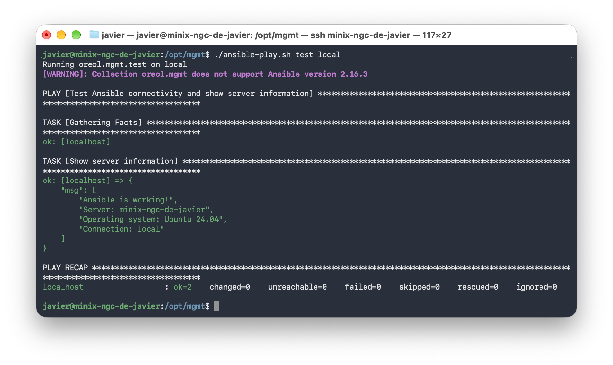

<p align="right">
<a href="https://oreol.ch">Oreol</a> <a href="https://github.com/oreolag/cli">CLI</a>
</p>

<!-- <p align="center" style="margin-bottom: 0px;">
  
</p> -->

<h1 align="center">
  Oreol Management
  <p align="center">
    <a href="https://github.com/oreolag/mgmt/releases"></a>
    <a href="https://github.com/oreolag/mgmt/blob/main/LICENSE"></a>
    <a href="https://github.com/oreolag/mgmt/graphs/contributors"></a>
    <a href="https://github.com/oreolag/mgmt/stargazers"></a>
  </p>
</h1>

`mgmt` simplifies software installation and low-level system configuration across heterogeneous compute clusters and remote servers. Built on the [Oreol Ansible Collection,](https://github.com/oreolag/ansible-collection) it brings together your inventory, variables, and configuration management database (CMDB) to consistently deploy software such as [Oreol CLI](https://github.com/oreolag/cli) and vLLM and manage the underlying systems.

## Installation
Run the following command on your Linux host (see [Supported Platforms](#supported-platforms)):

```bash
curl -H 'Cache-Control: no-cache' -fsSL https://oreol.ch/mgmt/install.sh | sudo bash
```

### Supported Platforms
`mgmt` currently supports Ubuntu-based Linux distributions. Validated environments include:

- Ubuntu
- NVIDIA DGX

Additional Linux distributions may work but are not officially validated yet.

### Testing the installation

Verify your installation by running the test playbook on the local server:

```bash
cd /opt/mgmt && ./ansible-play.sh test local
```


*The test displays **Ansible is working!**, your server's hostname, operating system, and connection type. It requires no sudo access and makes no changes to your system. A successful run ends with `failed=0` and `unreachable=0` in the recap.*

## Citation

[](https://doi.org/10.1145/3805700)

If you use `mgmt` in your research, development, or publications, please cite the following reference:

```bibtex
@article{moya2026hacc,
  author    = {Javier Moya and Matthias Gabathuler and Mario Ruiz and Gustavo Alonso},
  title     = {A Development Platform for Managed Heterogeneous Accelerated Compute Clusters: A Case Study on ETH Zurich’s AMD HACC},
  journal   = {ACM Transactions on Reconfigurable Technology and Systems},
  year      = {2026},
  doi       = {10.1145/3805700},
  url       = {https://doi.org/10.1145/3805700}
}
```
